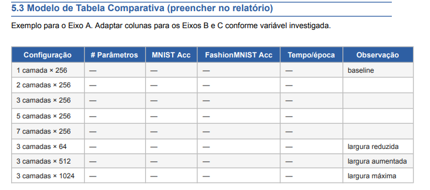
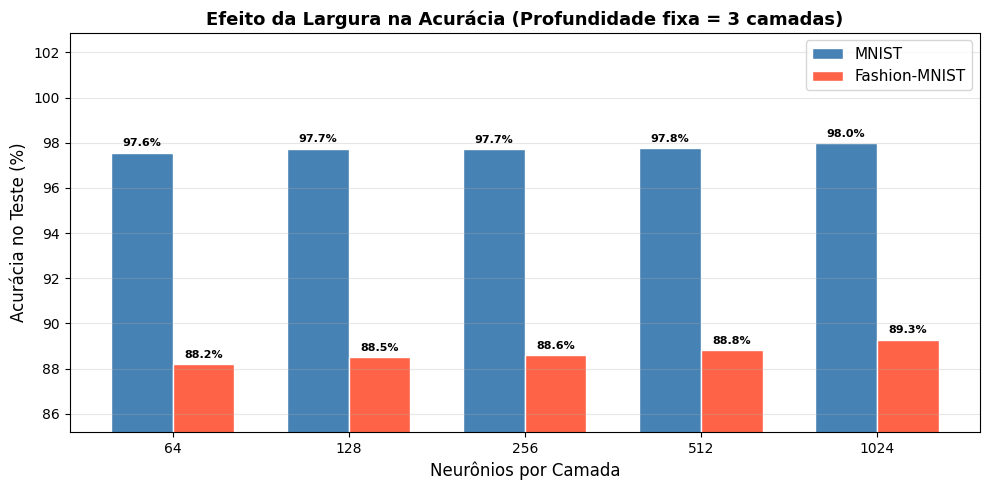
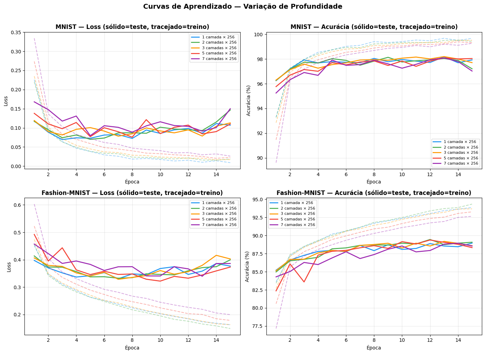

# Documento Comparativo - Eixo A

## 1. Identificacao
- Eixo: Eixo A - Profundidade e Largura da Rede
- Grupo: [preencher nome do grupo]
- Integrantes: [preencher nomes completos]
- Modalidade: Experimentos proprios (Modalidade 1)

## 2. Pergunta do Eixo
- Variavel comparada: impacto de profundidade (numero de camadas ocultas) versus largura (numero de neuronios por camada) no desempenho de redes DNN.
- Pergunta orientadora: "Mais camadas ou mais neuronios por camada, o que importa mais? A partir de qual profundidade o ganho marginal desaparece no MNIST e no Fashion-MNIST?"
- Hipotese inicial do grupo (antes da investigacao):
  - Em MNIST, ganhos de profundidade saturariam cedo por ser um dataset mais simples.
  - Em Fashion-MNIST, aumento de capacidade (especialmente largura) tenderia a trazer ganhos mais consistentes.

## 3. Tabela Comparativa

### 3.0 Modelo de referencia (imagem enviada)

### 3.0.1 Tabela comparativa consolidada (modelo solicitado)

| Configuracao | # Parametros | MNIST Acc (%) | Fashion-MNIST Acc (%) | Tempo/epoca (s) | Observacao |
|---|---:|---:|---:|---:|---|
| 1 camada x 256 | 203,530 | 97.93 | 88.95 | 13.98 | baseline |
| 2 camadas x 256 | 269,322 | 97.21 | 89.07 | 13.83 | |
| 3 camadas x 256 | 335,114 | 97.71 | 88.59 | 13.93 | |
| 5 camadas x 256 | 466,698 | 98.04 | 88.33 | 14.54 | |
| 7 camadas x 256 | 598,282 | 97.03 | 88.55 | 14.72 | |
| 3 camadas x 64 | 59,210 | 97.56 | 88.18 | 13.87 | largura reduzida |
| 3 camadas x 512 | 932,362 | 97.76 | 88.81 | 14.10 | largura aumentada |
| 3 camadas x 1024 | 2,913,290 | 97.97 | 89.27 | 14.49 | largura maxima |

### 3.1 Serie Profundidade (largura fixa = 256)

| Configuracao | Parametros | MNIST Acc (%) | Fashion-MNIST Acc (%) | Tempo medio/epoca (s) |
|---|---:|---:|---:|---:|
| 1 camada x 256 | 203,530 | 97.93 | 88.95 | 13.98 |
| 2 camadas x 256 | 269,322 | 97.21 | 89.07 | 13.83 |
| 3 camadas x 256 (baseline) | 335,114 | 97.71 | 88.59 | 13.93 |
| 5 camadas x 256 | 466,698 | 98.04 | 88.33 | 14.54 |
| 7 camadas x 256 | 598,282 | 97.03 | 88.55 | 14.72 |

### 3.2 Serie Largura (profundidade fixa = 3)

| Configuracao | Parametros | MNIST Acc (%) | Fashion-MNIST Acc (%) | Tempo medio/epoca (s) |
|---|---:|---:|---:|---:|
| 3 camadas x 64 | 59,210 | 97.56 | 88.18 | 13.87 |
| 3 camadas x 128 | 134,794 | 97.74 | 88.51 | 13.92 |
| 3 camadas x 256 (baseline) | 335,114 | 97.71 | 88.59 | 14.09 |
| 3 camadas x 512 | 932,362 | 97.76 | 88.81 | 14.10 |
| 3 camadas x 1024 | 2,913,290 | 97.97 | 89.27 | 14.49 |

## 4. Grafico ou Figura

### Figura 1 - Barra comparativa (Acuracia vs Largura)
Origem: grafico gerado pelo grupo a partir do notebook `profundidade_largura_dnn/eixo_a_profundidade_largura.ipynb`.

Legenda: Comparacao da acuracia de teste em funcao da largura da rede (3 camadas fixas). Observa-se tendencia de ganho mais consistente em Fashion-MNIST com aumento de neuronios por camada.

### Figura 2 - Curvas de aprendizado (Variacao de Profundidade)
Origem: grafico gerado pelo grupo a partir do notebook `profundidade_largura_dnn/eixo_a_profundidade_largura.ipynb`.

Legenda: Evolucao de loss e acuracia em treino e teste para diferentes profundidades (largura fixa = 256), permitindo observar convergencia e sinais de retorno decrescente.

## 5. Achado Principal
Nos experimentos, o aumento de largura mostrou comportamento mais consistente do que o aumento de profundidade, principalmente no Fashion-MNIST. Em MNIST, a melhor configuracao foi 5 camadas x 256 com 98.04% (ganho pequeno sobre outras configuracoes), mas com oscilacoes quando a rede ficou mais profunda (7 camadas caiu para 97.03%). Em Fashion-MNIST, a melhor configuracao foi 3 camadas x 1024 com 89.27%, indicando que, neste setup (ReLU, Adam, sem BatchNorm/Dropout, 15 epocas), ampliar neuronios por camada trouxe ganhos mais estaveis que adicionar muitas camadas. Isso sugere retorno decrescente de profundidade sem tecnicas de estabilizacao para redes mais fundas.

## 6. Limitacoes e Perguntas
- O comparativo nao respondeu completamente se redes profundas melhorariam com tecnicas de estabilizacao (BatchNorm, skip connections) e mais epocas.
- Tambem nao avaliou sensibilidade a hiperparametros (learning rate, regularizacao, scheduler), que pode alterar o resultado relativo entre profundidade e largura.
- O benchmark MNIST esta proximo de saturacao, reduzindo diferencas entre arquiteturas.

Perguntas em aberto:
- Em Fashion-MNIST, a vantagem de largura se manteria com regularizacao mais forte?
- O ponto de saturacao de profundidade muda ao usar BatchNorm ou residual connections?

Experimento adicional sugerido:
- Repetir as configuracoes de 5 e 7 camadas com BatchNorm (e opcionalmente Dropout), mantendo o restante fixo, e comparar: acuracia final, estabilidade de treino (curvas), tempo/epoca e gap de generalizacao.